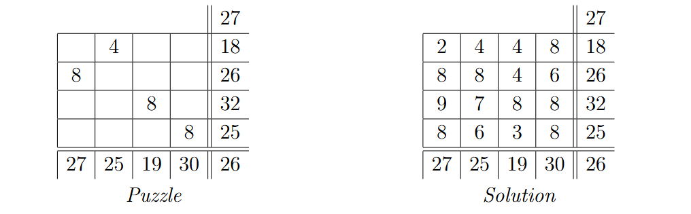

# The Challenger Puzzle

## Background
The Challenger puzzle is a newspaper puzzle where the goal is to fill empty cells with integer values 1 through 9 such that the rows, columns, main diagonal, and main counter-diagonal all sum to the corresponding values along the border. Each Challenger puzzle provides four filled-in values, one per row and columnn. 

  

One difference between the Challenger puzzle and many other newspaper puzzles is that the Challenger puzzle is not required to be well-posed, meaning that it may have more than one valid solution. This code accompanies a forthcoming paper that establishes necessary and sufficient conditions for well-posedness and determines that exactly 754,932,143,813,544 well-posed Challenger puzzles exist. 

## Code Usage